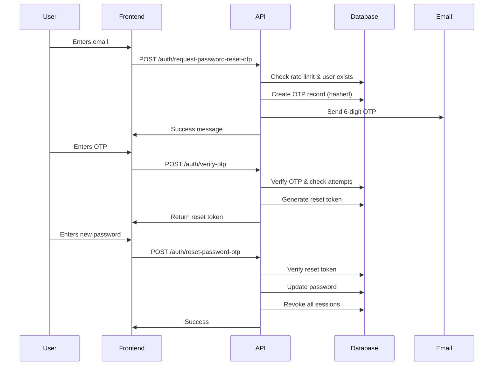

# OTP-Based Password Reset Feature

## Overview

This API now supports **OTP (One-Time Password) based password reset** functionality in addition to the traditional token-based password reset. The OTP method provides enhanced security by sending a 6-digit code via email.

## Features

✅ **6-digit OTP generation** - Secure random numeric codes  
✅ **Hashed OTP storage** - OTPs are bcrypt-hashed before database storage  
✅ **Rate limiting** - 60-second cooldown between OTP requests  
✅ **Attempt limiting** - Maximum 5 verification attempts per OTP  
✅ **Time-based expiry** - OTPs expire after 10 minutes  
✅ **Email delivery** - Beautiful HTML email templates via SMTP  
✅ **Two-step verification** - OTP verification returns a short-lived reset token

## Configuration

### Environment Variables

Add these to your `.env` file:

```env
# OTP Settings
OTP_EXPIRY_MINUTES=10          # OTP validity period (default: 10 minutes)
OTP_MAX_ATTEMPTS=5             # Maximum verification attempts (default: 5)
OTP_COOLDOWN_SECONDS=60        # Cooldown between OTP requests (default: 60 seconds)

# SMTP Configuration (required for sending OTPs)
SMTP_HOST=smtp.gmail.com
SMTP_PORT=587
SMTP_USER=your-email@gmail.com
SMTP_PASS=your-app-password    # Use App Password for Gmail
FROM_EMAIL=noreply@yourapp.com
FROM_NAME=StockMaster
BASE_URL=http://localhost:3000
```

### Gmail SMTP Setup

1. **Enable 2-Step Verification** in your Google Account
2. **Generate App Password**:
   - Go to Google Account → Security → 2-Step Verification → App passwords
   - Select "Mail" and "Other (Custom name)"
   - Copy the 16-character password
   - Use this as `SMTP_PASS` in your `.env` file

## API Endpoints

### 1. Request Password Reset OTP

**Endpoint:** `POST /auth/request-password-reset-otp`

**Request Body:**

```json
{
  "email": "user@example.com"
}
```

**Response (Success):**

```json
{
  "success": true,
  "message": "If an account with that email exists, an OTP has been sent to your email."
}
```

**Response (Rate Limited):**

```json
{
  "success": false,
  "message": "Please wait 45 seconds before requesting a new OTP."
}
```

**Notes:**

- Returns generic success message to prevent user enumeration
- If user exists, sends 6-digit OTP via email
- Rate limited to 1 request per 60 seconds per email
- Automatically invalidates previous unused OTPs

---

### 2. Verify OTP

**Endpoint:** `POST /auth/verify-otp`

**Request Body:**

```json
{
  "email": "user@example.com",
  "otp": "123456"
}
```

**Response (Success):**

```json
{
  "success": true,
  "message": "OTP verified successfully.",
  "data": {
    "resetToken": "abc123def456..."
  }
}
```

**Response (Invalid OTP):**

```json
{
  "success": false,
  "message": "Invalid OTP. 3 attempts remaining."
}
```

**Response (Expired OTP):**

```json
{
  "success": false,
  "message": "OTP has expired."
}
```

**Response (Max Attempts):**

```json
{
  "success": false,
  "message": "Maximum verification attempts exceeded. Please request a new OTP."
}
```

**Notes:**

- Maximum 5 attempts per OTP
- Returns a short-lived reset token (15 minutes) on success
- Increments attempt counter on each failed verification

---

### 3. Reset Password with OTP

**Endpoint:** `POST /auth/reset-password-otp`

**Request Body:**

```json
{
  "resetToken": "abc123def456...",
  "email": "user@example.com",
  "newPassword": "NewSecurePassword123!"
}
```

**Response (Success):**

```json
{
  "success": true,
  "message": "Password reset successfully. Please log in with your new password."
}
```

**Response (Invalid Token):**

```json
{
  "success": false,
  "message": "Invalid or expired reset token."
}
```

**Notes:**

- Reset token obtained from OTP verification step
- Token valid for 15 minutes
- Password must be at least 8 characters
- Invalidates all existing refresh tokens (forces logout on all devices)

---

## Complete Password Reset Flow

### Step-by-Step Process:



### Example Frontend Flow:

```typescript
// Step 1: Request OTP
const requestOTP = async (email: string) => {
  const response = await fetch("/auth/request-password-reset-otp", {
    method: "POST",
    headers: { "Content-Type": "application/json" },
    body: JSON.stringify({ email }),
  });

  const data = await response.json();
  // Show "OTP sent to email" message
};

// Step 2: Verify OTP
const verifyOTP = async (email: string, otp: string) => {
  const response = await fetch("/auth/verify-otp", {
    method: "POST",
    headers: { "Content-Type": "application/json" },
    body: JSON.stringify({ email, otp }),
  });

  const data = await response.json();
  // Store resetToken for next step
  return data.data.resetToken;
};

// Step 3: Reset Password
const resetPassword = async (
  resetToken: string,
  email: string,
  newPassword: string
) => {
  const response = await fetch("/auth/reset-password-otp", {
    method: "POST",
    headers: { "Content-Type": "application/json" },
    body: JSON.stringify({ resetToken, email, newPassword }),
  });

  const data = await response.json();
  // Redirect to login page
};
```

## Security Features

### 1. **OTP Hashing**

- OTPs are hashed with bcrypt (12 rounds) before storage
- Plain OTP never stored in database

### 2. **Rate Limiting**

- Cooldown period between OTP requests (60 seconds default)
- Prevents OTP spam and brute force attempts

### 3. **Attempt Limiting**

- Maximum 5 verification attempts per OTP
- After max attempts, user must request new OTP

### 4. **Time-Based Expiry**

- OTP expires after 10 minutes
- Reset token expires after 15 minutes

### 5. **User Enumeration Prevention**

- Generic success messages for non-existent emails
- Prevents attackers from discovering valid accounts

### 6. **Session Invalidation**

- All refresh tokens revoked after password reset
- Forces logout on all devices for security

### 7. **Token Invalidation**

- Previous unused OTPs invalidated when new OTP requested
- Reset tokens are single-use only

## Database Schema

### PasswordResetOTP Table

```prisma
model PasswordResetOTP {
  id        String   @id @default(cuid())
  otp       String   // Hashed OTP
  userId    String
  email     String
  expiresAt DateTime
  verified  Boolean  @default(false)
  attempts  Int      @default(0)
  createdAt DateTime @default(now())
  user      User     @relation(fields: [userId], references: [id], onDelete: Cascade)

  @@index([userId])
  @@index([email])
  @@index([expiresAt])
}
```

## Testing

### Manual Testing with cURL

```bash
# 1. Request OTP
curl -X POST http://localhost:4000/auth/request-password-reset-otp \
  -H "Content-Type: application/json" \
  -d '{"email":"user@example.com"}'

# 2. Verify OTP (check your email for the 6-digit code)
curl -X POST http://localhost:4000/auth/verify-otp \
  -H "Content-Type: application/json" \
  -d '{"email":"user@example.com","otp":"123456"}'

# 3. Reset Password (use reset token from step 2)
curl -X POST http://localhost:4000/auth/reset-password-otp \
  -H "Content-Type: application/json" \
  -d '{
    "resetToken":"your-reset-token-here",
    "email":"user@example.com",
    "newPassword":"NewSecurePassword123!"
  }'
```

## Troubleshooting

### OTP Email Not Received

1. **Check SMTP credentials** in `.env` file
2. **Verify SMTP settings** match your email provider
3. **Check spam folder** - OTP emails might be filtered
4. **Enable "Less secure app access"** for non-Gmail providers
5. **Use App Password** for Gmail (not your account password)

### "Maximum attempts exceeded"

- Request a new OTP using `/auth/request-password-reset-otp`
- Wait for cooldown period (60 seconds) before requesting

### "OTP has expired"

- OTPs are valid for 10 minutes
- Request a new OTP if expired

### Rate Limit Error

- Wait for the specified cooldown period
- Default is 60 seconds between OTP requests

## Migration from Token-Based Reset

The original token-based password reset endpoints are still available:

- `POST /auth/request-password-reset` - Request reset link via email
- `POST /auth/reset-password` - Reset password with token from email link

You can use either method based on your frontend requirements.

## Future Enhancements

- [ ] SMS OTP support (Twilio integration)
- [ ] Admin panel for OTP monitoring
- [ ] Configurable OTP length (4-8 digits)
- [ ] IP-based rate limiting
- [ ] Account lockout after multiple failed attempts
- [ ] Multi-language email templates
- [ ] OTP analytics and logging

## Support

For issues or questions, please contact the development team or create an issue in the repository.
